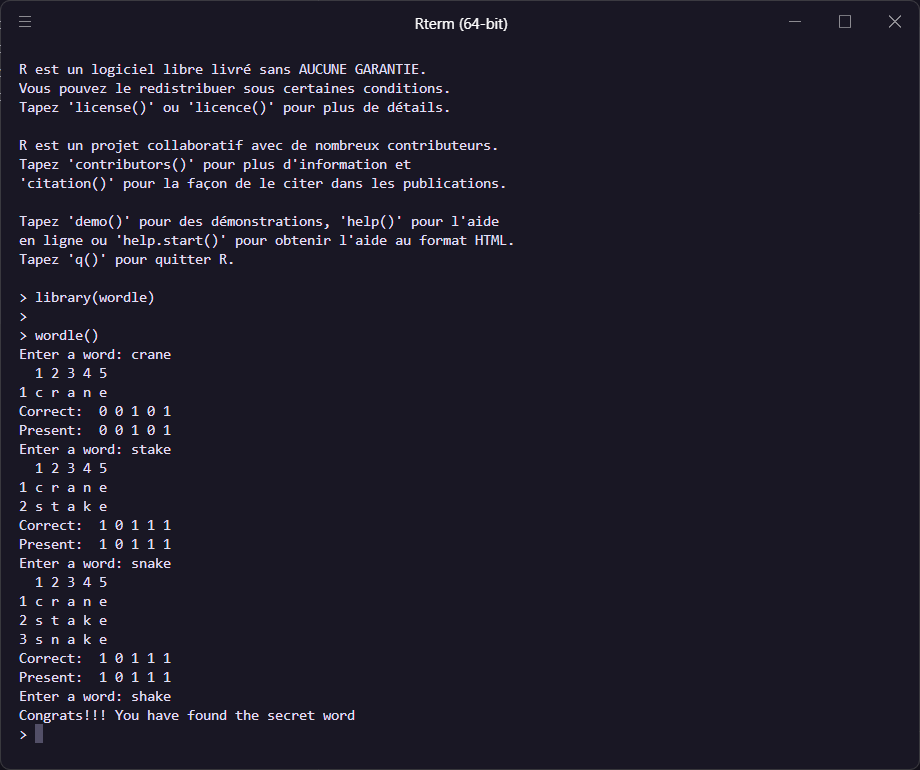

# Wordle in the R Console

I created this project to learn how to create a package in R. I do not aim to provide new functionality to R *(it is quite easy to find other similar projects on Github)*. If you wish to install this package on your device, run:

```r
# install.packages("devtools") 
library(devtools)

install_github("andregl/wordle")
```

The game can be played once the package is loaded by running ```wordle()```. In the terminal, the game looks as follows:



For each attempt, the output is kept at a minimum, only presenting the necessary information. Also, the program does not check whether the attempted word is within the list of available words. This task is left to the player.
